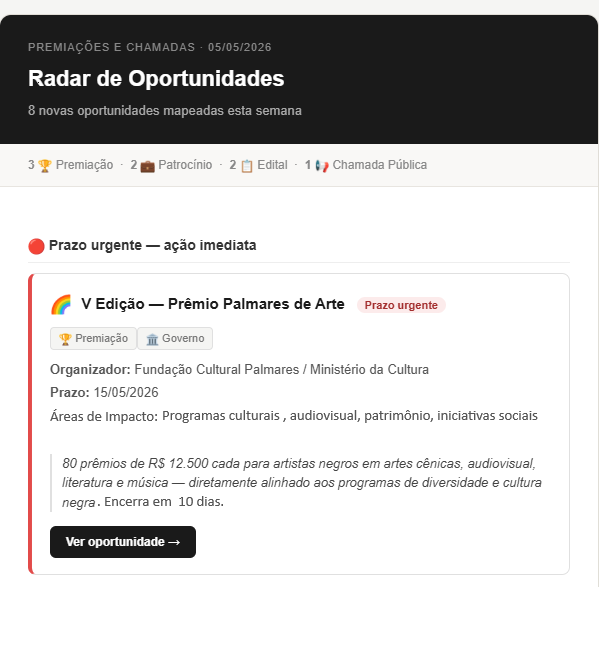

# strategic-opportunity-radar

Automação criada para monitorar oportunidades estratégicas (editais, premiações e chamadas públicas) e reduzir o risco de perda de oportunidades relevantes

---

## Problema

O processo anterior era manual e dependia de buscas recorrentes, o que gerava:

- Retrabalho operacional
- Informações descentralizadas
- risco de perder oportunidades importantes

##  Objetivo

- redução de trabalho manual
- centralização das oportunidades
- maior velocidade de resposta
- menor risco de perda de oportunidades

  
---

## Fluxo Implementado

AI Search → JSON Output → Python Processing → Automated Email Delivery

##  Demonstração Visual

  

---

##  Ferramentas & Técnicas Utilizadas

- **Python**
- **JSON**
- **SMTP**
- **HTML Email**
- **Prompt Engineering**
- **Process Automation**

